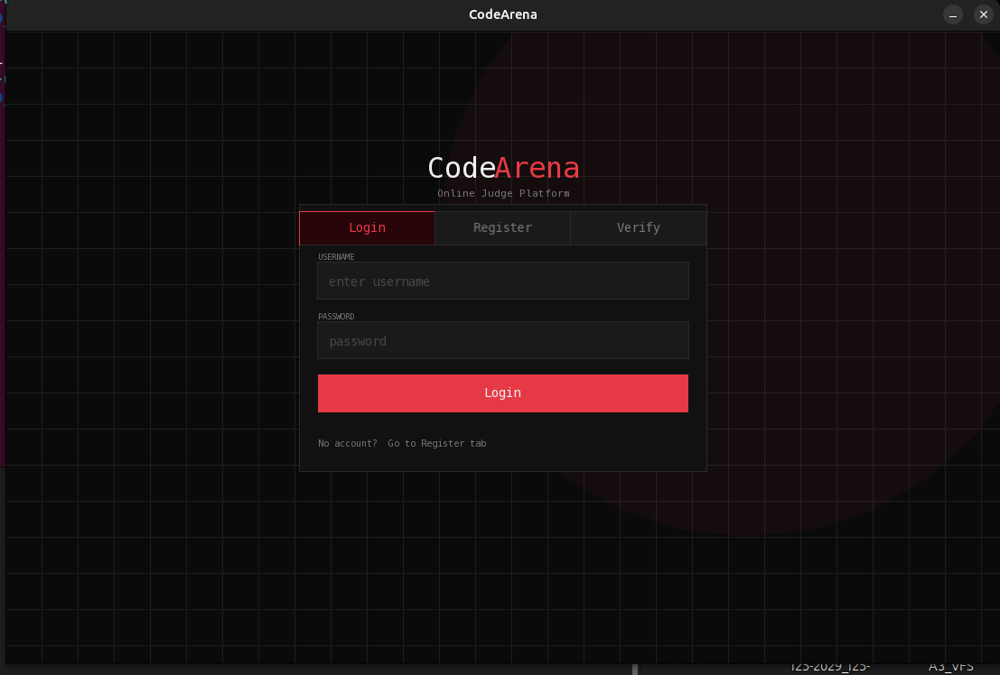
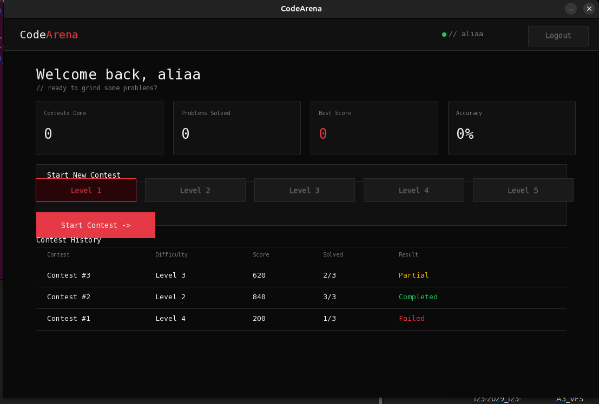
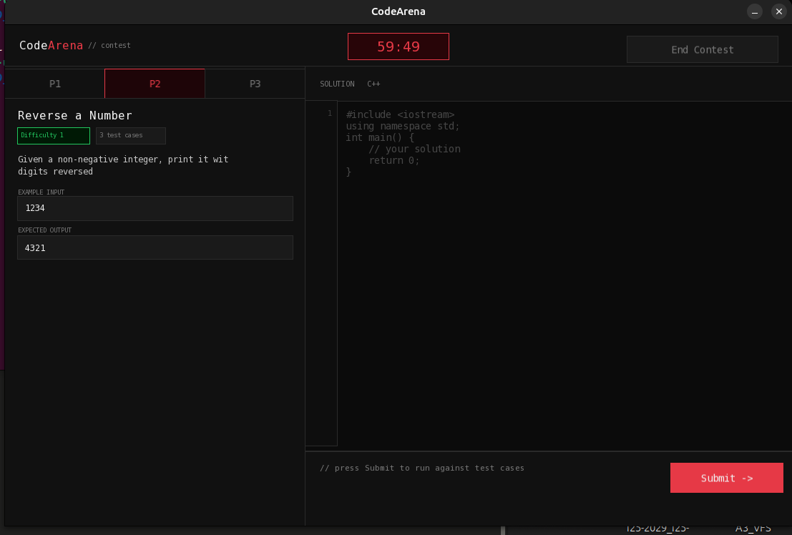

# CodeArena 🏟️
### A Desktop-Based Online Judge Platform

> Built as an Object-Oriented Programming Final Project at **FAST-NUCES Islamabad**

  

---

## 📌 Overview

CodeArena is a fully functional competitive programming platform built entirely from scratch in **C++ with SFML**. It features a desktop GUI, user authentication, timed contests, an automated judge, and a custom Virtual File System for data persistence — **no STL containers used**.

---

## ✨ Features

- 🔐 **User Authentication** — Register, Login, and Email Verification with djb2 password hashing
- 🏠 **Dashboard** — View contest history, problems solved, best score, and accuracy
- ⏱️ **Timed Contests** — Easy, Medium, and Hard difficulty levels with countdown timer
- 📝 **Code Editor** — Built-in C++ editor with problem statement, example I/O, and submit button
- ⚖️ **Auto Judge** — Runs submissions against test cases and returns Accepted / Partial / Failed
- 💾 **Virtual File System** — Custom VFS layer for disk-based persistence (no STL, no databases)
- 🗂️ **Custom Data Structures** — `DynamicArray<T>` and `HashMap<K,V>` implemented from scratch

---

## 🏗️ Architecture

```
CodeArena/
├── main.cpp                  # Entry point
├── GUI.cpp / GUI.h           # All SFML screens (Login, Dashboard, Contest)
├── User.cpp                  # User management & authentication
├── Session.cpp               # Active session handling
├── Contest.cpp               # Base contest class
├── EasyContest.cpp           # Difficulty-specific contest logic
├── MediumContest.cpp
├── HardContest.cpp
├── Judge.cpp                 # Auto-judging engine
├── Problem.cpp / ProblemBank.cpp
├── Submission.cpp / TestCase.cpp
├── VFSAdapter.cpp            # Bridge between app and VFS
├── MyString.cpp              # Custom string class
└── 25i-6601_*.cpp/h          # Virtual File System layer
    ├── FSEntity (abstract base)
    ├── File, Directory, SymbolicLink
    ├── Volume, Partition, MountPoint
    ├── Permission, User, VersionRecord
    └── ExtendedAttribute
```

---

## 🛠️ Tech Stack

| Component | Technology |
|-----------|-----------|
| Language | C++14 |
| GUI | SFML 2.x |
| Data Persistence | Custom Virtual File System |
| Data Structures | Custom (no STL) |
| Build | Bash compile script |

---

## 🚀 Build & Run

### Prerequisites
```bash
sudo apt install libsfml-dev g++
```

### Compile
```bash
cd fixed_sfml
chmod +x compile.sh
./compile.sh
```

### Run
```bash
./codearena
```

---

## 📸 Screenshots

| Login | Dashboard | Contest |
|-------|-----------|---------|
|  |  |  |

---

## 👥 Team

| Role | Contribution |
|------|-------------|
| Muhammad Uzair | SFML GUI, User/Data Layer, VFS Integration |
| Team Member 2 | *(add name)* |
| Team Member 3 | *(add name)* |

---

## 📚 Course

**Object-Oriented Programming (CS-2001)**  
FAST-NUCES Islamabad — Spring 2025

---

> *"Real-world software isn't just about writing code — it's about designing systems that actually work."*
